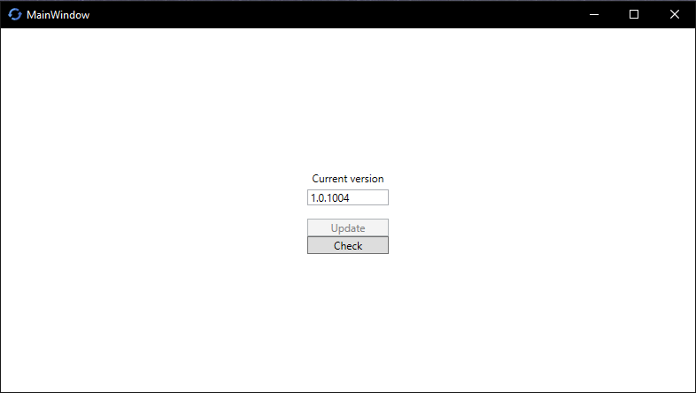
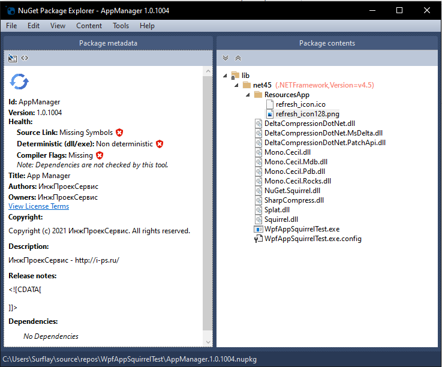
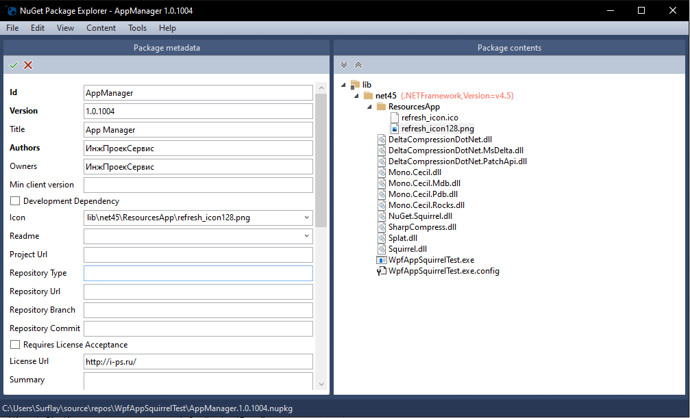

| README.md |
|:---|

Squirrel - это одновременно набор инструментов и библиотека для полного управления установкой и обновлением вашего настольного приложения Windows, написанного на C#

# WpfAppSquirrelTest

Почему я использую Squirrel?
Потому что приложения для Windows должны быть такими же быстрыми и простыми в установке и обновлении, как у Google Chrome или Discord.

Если решили выпустить обновление, то выполняем порядок дейстий:

	1. Компилируем проект в режиме Release
	2. Открываем NPE (NuGet Package Explorer)
	3. Создаём новый package - Create a new package (Ctrl + N)
	4. Редактируем метаданные - Edit Metadata (Ctrl + K)
	5. В панель Package contents создаём папку lib, в lib создаём net45, в net45 добавляем скомпилированные нами Release файлы, но без *.pdb
	6. Сохраняем NPE проект в директорию с проектом Visual Studio, где распологается файл *.sln (В моё случае сохранился файл с именем MyApp.1.0.0.nupkg)
	7. Заходим в Visual Studio, открываем Консоль диспетчера пакетов
	8. В Диспетчере пакетов пишем команду:
	PM> Squirrel --releasify MyApp.1.0.0.nupkg
	9. После заходим на github, который мы указали в коде программы, из этого репозетория будет загружаться программа
	10. Заходим в вкладку Release и создаём новый релиз приложения, загружаем файлы Releases папки, в которой находится последняя версия приложения (MyApp.1.0.0.nupkg + RELEASES + Setup.exe)
	11. Публикуем, теперь у других пользователей приложение обновится в автоматическом режиме, а для установки требуется всего лишь открыть Setup.exe

	P.S.: MyApp.1.0.0.nupkg - сохраненное название файла из NPE (NuGet Package Explorer)
	P.S.2: AssemblyInfo должен иметь формат X.Y.Z (1.0.1009), если другой, то не будет работать Squirrel --releasify

# Приложение после проверки версии и самостоятельой установки обновления 

# Структура файла NPE 

# Настройки файла NPE 

